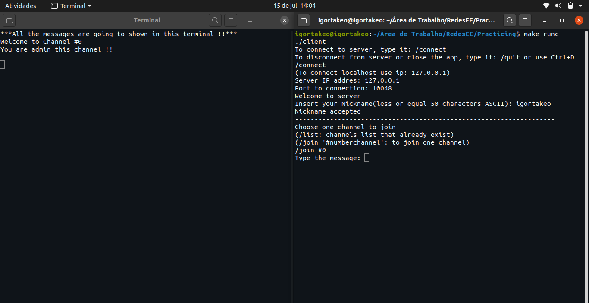

# IRC-Redes
Internet Relay Chat implementado em C++ para a disciplina de Redes de Computadores. 

## Autores
- Igor Takeo Ambo de Melo / Número USP: 10830054
- Mateus Ferreira Gomes / Número USP: 10734773
- Guilherme Targon Marques Barcellos / Número USP: 10724181

## Comandos para compilar e rodar no Terminal Linux.
- git clone https://github.com/igortakeo/IRC-Redes.git

- cd IRC-Redes/ (Para entrar na pasta que contém os arquivos).
´
- make all (Para compilar todos os arquivos .cpp).

- make runs (Para rodar o servidor).

- make runc (Para rodar o cliente).

- make clean (Para excluir da pasta os arquivos executáveis).

> **OBS: Abra outro terminal para rodar o cliente caso esteja na mesma máquina em que o servidor foi iniciado**.

## Como usar
Rodando o servidor será pedido uma porta para a conexão, se a conexão for bem sucedida será mostrada a mensagem "Open Server", se não será mostrada "Bind Failed".
Caso queira fazer port-forwarding o cliente irá pedir o IP e a porta para a conexão. Já se quiser fazer uma conexão localhost use o **IP: 127.0.0.1** e a mesma porta usada para estabelecer a conexão do servidor.

Após a conexão com o canal de comunicação será aberto outro terminal, para mostrar as mensagens dos clientes que estão conectados ao canal.

Todos as mensagens devem ser escritas no terminal do cliente, o terminal do canal mencionado anteriormente só irá mostrar as mensagens.

Para fechar a conexão basta digitar **/quit** ou usar o comando **CTRL + D**

Todos os canais seguem a mesma regra para o nome **#(Número)** (Por exemplo: #0 e #55).

Disposição dos terminais para melhor uso do programa e exemplo de uma conxeão do cliente.

## Comandos disponíveis para o cliente
- /connect - Estabelece a conexão com o servidor.
- /quit - O cliente fecha a conexão e fecha a aplicação.
- /ping - O servidor retorna **pong** assim que receber a mensagem.
- /join #(Número) - Entra no canal.
- /nickname ApelidoDesejado - Muda o nickname pelo apelido especificado.

## Comandos apenas para os administradores dos canais
- /kick nickname - Fecha a conexão do usuário com o nickname especificado.
- /mute nickname - Impede que o usuário com o nickname especificado mande mensagem.
- /unmute nickname - Retira o mute do usuário.
- /whois nickname - Retorna o endereço de IP do usuário apenas para o adm do canal.

## Sobre
> Versão Linux: Ubuntu 20.04 LTS
> Compilador: gcc version 9.3.0(Ubuntu 9.3.0-10ubuntu2)
